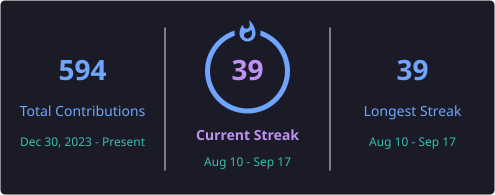

<h1 align="center">Hi 👋, I'm Utkarsh Pratap Singh</h1>

<h3 align="center">Software Developer • DSA in C++ • Frontend Development</h3>

  
  
  

  
  

---

## 👨‍💻 About Me

I'm a developer from India focused on **problem solving, Data Structures & Algorithms, and software development**.

Currently, I'm working with **C++ for DSA** while continuing to build frontend projects and strengthen my development fundamentals.

- 🔭 Working on [C++ DSA Series](https://github.com/BuildBy-Utkarsh/CPP-DSA-Series)
- 🌱 Learning **DSA + Frontend Development**
- 💻 Building projects and practicing problem solving consistently
- 📝 Sharing my learning journey on [X](https://x.com/UtkarshSolves)
- 📫 **singhutkarsh297@gmail.com**
- ⚡ Fun fact: **I think I'm funny 😄**

---

## 🛠️ Tech Stack

### Languages

### Frontend

### Backend & Databases

### Tools

---

# 📊 GitHub Analytics

  
  

---

# 🔥 Contribution Streak

  

---

# 📈 Contribution Activity

  

---

# 🚀 Featured Projects

<table align="center">
  <tr>
    <td width="50%" valign="top">
      <h3 align="center">C++ DSA Series</h3>
      
A structured collection of DSA concepts, implementations and problem-solving practice in C++.

      
<a href="https://github.com/BuildBy-Utkarsh/CPP-DSA-Series"><strong>View Repository →</strong></a>

    </td>
    <td width="50%" valign="top">
      <h3 align="center">Web Development</h3>
      
My frontend learning journey, projects and practical implementations.

      
<a href="https://github.com/BuildBy-Utkarsh/web-dev"><strong>View Repository →</strong></a>

    </td>
  </tr>
  <tr>
    <td width="50%" valign="top">
      <h3 align="center">100 Basic Problems</h3>
      
A collection of 100 basic programming problems for building problem-solving fundamentals.

      
<a href="https://github.com/BuildBy-Utkarsh/100BasicProblems"><strong>View Repository →</strong></a>

    </td>
    <td width="50%" valign="top">
      <h3 align="center">Amazon Clone</h3>
      
A frontend Amazon clone built while practicing HTML and CSS.

      
<a href="https://github.com/BuildBy-Utkarsh/amazon-clone"><strong>View Repository →</strong></a>

    </td>
  </tr>
</table>

<a href="https://github.com/BuildBy-Utkarsh?tab=repositories">View all repositories →</a>

---

# 🐍 Contribution Snake

  <picture>
    <source media="(prefers-color-scheme: dark)" srcset="https://raw.githubusercontent.com/BuildBy-Utkarsh/BuildBy-Utkarsh/output/github-contribution-grid-snake-dark.svg">
    <source media="(prefers-color-scheme: light)" srcset="https://raw.githubusercontent.com/BuildBy-Utkarsh/BuildBy-Utkarsh/output/github-contribution-grid-snake.svg">
    
  </picture>

---

# 📚 Learning in Public

I regularly share my coding progress, projects, problem-solving practice and development journey.

---

# 🤝 Connect With Me

  
  
  
  
  

📫 <strong>Email:</strong> singhutkarsh297@gmail.com

---

⭐ If you find my repositories useful, consider giving them a star!

